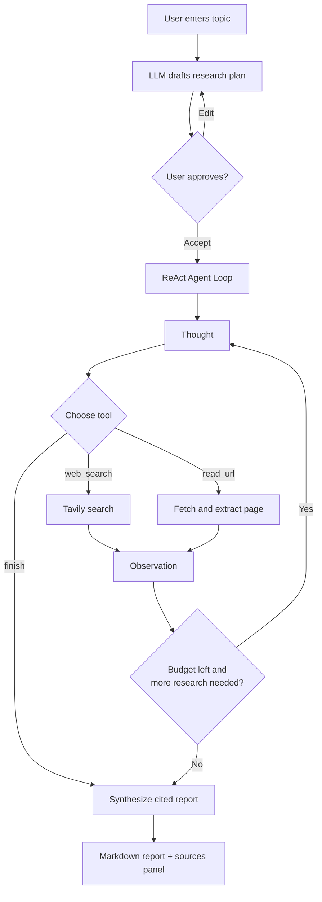

# Deep Researcher Agent

An autonomous AI research assistant. Give it a topic and it will plan, search
the web, read sources, and synthesize a fully cited Markdown report — all in
your browser.

> **Experimental.** AI responses may be inaccurate; always double-check.

---

## Features

- **Guided workflow**: Topic → Plan → Searching → Report stepper at the top
  so you always know where you are.
- **Plan-first**: The agent drafts a research plan and lets you approve,
  edit, or regenerate it before any searches run.
- **Prompt templates**: Curated starter prompts for common research patterns.
- **ReAct agent loop**: Thought → Action → Observation cycles using
  `web_search` and `read_url` tools, with a configurable step + source budget.
- **Live trace**: Collapsible view of every thought, search, and page read.
- **Cited Markdown report**: Inline links back to every source.
- **Bring-your-own keys**: Optional client-side override of the NaviGator
  (LLM) and Tavily (web search) API keys.

---

## How it works



### Components

- **PromptInput** — topic entry, templates, model + max-sources settings.
- **PlanReview** — renders the plan and accepts free-form edits or full
  regeneration before research starts.
- **WorkflowStepper** — horizontal Topic / Plan / Searching / Report indicator.
- **AgentTrace** — collapsible thought / search / read / finish trace.
- **ReportView + SourcesPanel** — final cited Markdown + deduplicated source list.

### Server functions

All API keys stay server-side. Three TanStack Start server functions
(`createServerFn`) wrap the providers:

- `navigator-chat.functions.ts` — proxies the UF NaviGator chat completions
  endpoint (the LLM brain).
- `web-search.functions.ts` — proxies Tavily web search.
- `read-url.functions.ts` — proxies Tavily page extraction.

---

## Tech stack

- **TanStack Start** (React 19, Vite 7, SSR-ready, Cloudflare Workers target)
- **Tailwind CSS v4** with semantic design tokens in `src/styles.css`
- **shadcn/ui** primitives
- **Zod** input validation on every server function
- **react-markdown** + **remark-gfm** for report rendering

---

## Local development

```bash
bun install
bun run dev
```

Set these environment variables (or paste keys at runtime via the API keys
panel in the UI):

```bash
UF_NAVIGATOR_API_KEY=...
TAVILY_API_KEY=...
```

---

## Project structure

```text
src/
├── routes/
│   ├── __root.tsx          # SSR shell, sitewide meta
│   └── index.tsx           # State machine: input → plan → research → done
├── components/research/    # PromptInput, PlanReview, WorkflowStepper,
│                           # AgentTrace, ProgressTracker, ReportView,
│                           # SourcesPanel, Disclaimer, PasswordGate
├── lib/
│   ├── navigator-chat.functions.ts   # LLM server fn
│   ├── web-search.functions.ts       # Tavily search server fn
│   ├── read-url.functions.ts         # Tavily extract server fn
│   ├── agent-prompts.ts              # ReAct system + observation prompts
│   ├── plan-prompts.ts               # Plan + revision prompts
│   ├── research-templates.ts         # Curated prompt templates
│   ├── models.ts                     # NaviGator model list
│   └── user-settings.ts              # localStorage settings
└── styles.css              # Design tokens (oklch)
```
