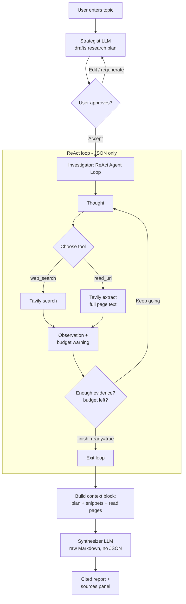

# Deep Researcher Agent

An autonomous AI research assistant. Give it a topic and it will plan, search
the web, read sources, and synthesize a fully cited Markdown report — all in
your browser.

> **Experimental.** AI responses may be inaccurate; always double-check.

---

## Features

- **Guided workflow**: Topic → Plan → Searching → Report stepper at the top
  so you always know where you are.
- **Plan-first**: A strategist LLM drafts an actionable research plan
  (objective, key questions, suggested queries, target sources, pitfalls,
  report structure) and lets you approve, edit, or regenerate it before any
  searches run.
- **Two-agent architecture**: A ReAct **investigator** gathers evidence,
  then a dedicated **synthesizer** writes the final report. Splitting these
  roles avoids JSON-escaping crashes on large Markdown and produces
  higher-quality, fully-cited prose.
- **Prompt templates**: Curated starter prompts for common research patterns.
- **Live trace**: Collapsible view of every thought, search (with site
  favicons), and page read.
- **Cited Markdown report**: Inline links back to every source.
- **Bring-your-own keys**: Optional client-side override of the NaviGator
  (LLM) and Tavily (web search) API keys.

---

## How it works

The app uses three specialized LLM roles instead of one monolithic prompt:

1. **Strategist** drafts the research plan from the user's topic.
2. **Investigator** (ReAct loop) iteratively searches and reads sources
   until it has enough evidence. Its `finish` tool just signals readiness —
   it does **not** write the report.
3. **Synthesizer** receives the original question, the approved plan, the
   collected search snippets, and the full-text read pages, and writes the
   final cited Markdown report in a single raw-text (non-JSON) call.



### Why split the agent?

| Concern | Single ReAct loop | Split investigator + synthesizer |
| --- | --- | --- |
| JSON safety | A single unescaped quote in a 1,500-word Markdown report crashes `JSON.parse()`. | Zero risk — synthesis returns raw Markdown. |
| Report quality | Model splits attention between JSON schema and prose. | Model focuses entirely on synthesis and citations. |
| Context | Cluttered with prior thoughts and tool errors. | Clean: question + plan + sources only. |
| Latency / cost | Slightly faster, fewer tokens. | One extra call, but dramatically better output. |

### Components

- **PromptInput** — topic entry, templates, model + max-sources settings.
- **PlanReview** — renders the plan and accepts free-form edits or full
  regeneration before research starts.
- **WorkflowStepper** — horizontal Topic / Plan / Searching / Report indicator.
- **AgentTrace** — collapsible thought / search / read / finish trace with
  per-result favicon thumbnails.
- **ReportView + SourcesPanel** — final cited Markdown + deduplicated source list.

### Server functions

All API keys stay server-side. Three TanStack Start server functions
(`createServerFn`) wrap the providers:

- `navigator-chat.functions.ts` — proxies the UF NaviGator chat completions
  endpoint. Called three times per research run: planner, investigator
  turns (JSON mode), and synthesizer (raw Markdown).
- `web-search.functions.ts` — proxies Tavily web search.
- `read-url.functions.ts` — proxies Tavily page extraction.

### Prompts

- `plan-prompts.ts` — strategist system prompt + revision prompt.
- `agent-prompts.ts` — investigator ReAct prompt, observation builders,
  budget warnings, **and** the synthesizer prompt + context-block builder
  (`SYNTHESIS_SYSTEM_PROMPT`, `buildSynthesisUserMessage`).

---

## Tech stack

- **TanStack Start** (React 19, Vite 7, SSR-ready, Cloudflare Workers target)
- **Tailwind CSS v4** with semantic design tokens in `src/styles.css`
- **shadcn/ui** primitives
- **Zod** input validation on every server function
- **react-markdown** + **remark-gfm** for report rendering

---

## Local development

```bash
bun install
bun run dev
```

Set these environment variables (or paste keys at runtime via the API keys
panel in the UI):

```bash
UF_NAVIGATOR_API_KEY=...
TAVILY_API_KEY=...
```

---

## Project structure

```text
src/
├── routes/
│   ├── __root.tsx          # SSR shell, sitewide meta
│   └── index.tsx           # State machine: input → plan → research → done
├── components/research/    # PromptInput, PlanReview, WorkflowStepper,
│                           # AgentTrace, ProgressTracker, ReportView,
│                           # SourcesPanel, Disclaimer, PasswordGate
├── lib/
│   ├── navigator-chat.functions.ts   # LLM server fn
│   ├── web-search.functions.ts       # Tavily search server fn
│   ├── read-url.functions.ts         # Tavily extract server fn
│   ├── agent-prompts.ts              # ReAct system + observation prompts
│   ├── plan-prompts.ts               # Plan + revision prompts
│   ├── research-templates.ts         # Curated prompt templates
│   ├── models.ts                     # NaviGator model list
│   └── user-settings.ts              # localStorage settings
└── styles.css              # Design tokens (oklch)
```
