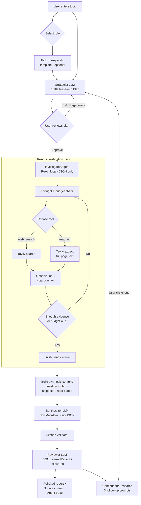
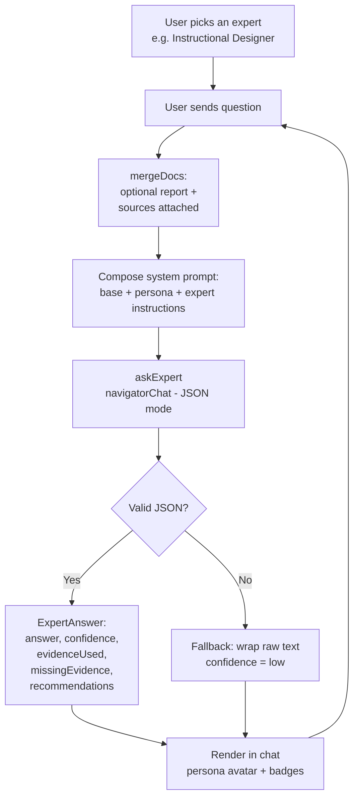
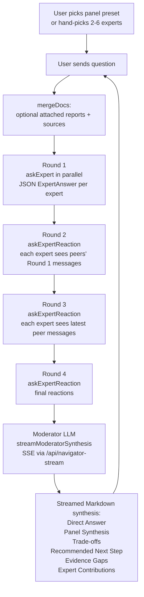

# Deep Researcher Agent


An AI research assistant for the UF College of Education with two modes:

- **Deep Research** — an autonomous agent that plans, searches the web, reads
  sources, and writes a fully cited Markdown report in one run.
- **Mixture of Experts (MoE) Chat** — converse with carefully prompted expert
  personas, either one-on-one (Single Expert) or as a multi-round panel
  (Expert Panel) with a moderator synthesis at the end.

> **Experimental.** AI responses may be inaccurate; always double-check
> citations and claims.

---

## Screenshots


---

## Features

- **Two top-level modes** — toggle between Deep Research and MoE Chat from the
  header. Each mode has its own workspace, history, and settings.
- **Role-based prompt library** — 9 user roles, each with 6 curated starter
  prompts (Researcher, School Teacher, Higher-Ed Instructor, Instructional
  Designer, Education Leader, Experience Designer, Software Developer,
  Communications & Marketing, Business & Operations).
- **Plan-first research** — a Strategist LLM drafts an actionable research
  plan (objective, key questions, queries, target sources, pitfalls, report
  structure) that you can approve, edit, or regenerate.
- **Multi-agent research pipeline** — Strategist → Investigator (ReAct) →
  Synthesizer → Reviewer. Splitting roles avoids JSON-escaping crashes on
  long Markdown and produces higher-quality, fully-cited prose.
- **MoE Chat (Single Expert)** — pick one expert persona and chat 1:1. The
  expert stays in character and answers with structured evidence,
  missing-evidence, and recommendation fields.
- **MoE Chat (Expert Panel)** — convene 2–6 experts on a topic. They debate
  across 4 rounds, then a moderator synthesizes a single answer with
  trade-offs and a recommended next step.
- **Bring-your-own keys** — optional client-side override of NaviGator (LLM),
  Tavily (web search), and Firecrawl (crawler) API keys.

---

## Deep Research — how it works

The agent is split into specialized LLM roles instead of one monolithic prompt:

1. **Strategist** drafts the research plan from the user's topic.
2. **Investigator** runs a strict ReAct loop, choosing one of `web_search`
   (Tavily), `read_url` (Tavily extract), or `finish` on every turn. Its
   `finish` tool just signals readiness — it does **not** write the report.
3. **Synthesizer** receives the question, plan, snippets, and read pages and
   writes the final cited Markdown in a single raw-text call.
4. **Citation validator** strips any inline link whose URL was not actually
   gathered, so hallucinated citations can't reach the final report.
5. **Reviewer** (the synthesizer returning in JSON mode) polishes the draft
   and proposes 3 follow-up research prompts you can launch in one click.



### Why split the agent?

| Concern | Single ReAct loop | Split investigator + synthesizer |
| --- | --- | --- |
| JSON safety | A single unescaped quote in a 1,500-word Markdown report crashes `JSON.parse()`. | Zero risk — synthesis returns raw Markdown. |
| Report quality | Model splits attention between JSON schema and prose. | Model focuses entirely on synthesis and citations. |
| Context | Cluttered with prior thoughts and tool errors. | Clean: question + plan + sources only. |
| Latency / cost | Slightly faster, fewer tokens. | One extra call, dramatically better output. |

---

## Mixture of Experts Chat — how it works

MoE Chat reuses the persona library from Deep Research but skips the web
research loop. Instead, expert personas (each with their own system prompt
and model) respond directly. There are two user-facing modes plus an
internal `auto` router used to pick experts on the fly.

Shared building blocks (`src/lib/moe-chat.ts`, `src/lib/moe-prompts.ts`):

- `askExpert` — calls one expert in JSON mode and parses
  `{ answer, confidence, evidenceUsed, missingEvidence, recommendations }`.
- `routeExperts` — the **Router** LLM picks 1–6 expert IDs for a question
  (only used by `auto` mode and the panel-preset suggester).
- `synthesizePanel` / `streamModeratorSynthesis` — the **Moderator** LLM
  combines expert answers into a single Markdown response with fixed
  headings: Direct Answer, Expert Panel Synthesis, Trade-offs, Recommended
  Next Step, Evidence Gaps, Expert Contributions.
- `askExpertReaction` — short reaction turn used in the panel's discussion
  rounds; each expert sees peers' latest messages and replies in character.

Optional attached docs (completed Deep Research reports plus their sources)
are merged via `mergeDocs` and prepended as a grounded knowledge block, so
experts can ground answers in real citations when available.

### Single Expert mode

You pick one persona up front and chat with them directly. No router, no
moderator — every turn is a single `askExpert` call.



### Expert Panel mode

You either pick a preset panel (Education, Higher Education, Product Design,
Implementation Strategy, Technical Feasibility) or hand-pick 2–6 experts.
Every user turn runs **4 rounds of expert messages** plus a streamed
moderator synthesis. Rounds 2–4 are reaction rounds where each expert sees
their peers' latest messages before replying.



Events emitted by `runMoeTurnStreaming` so the UI can render incrementally:
`routed` → `stage(round1..round4 | moderator)` → `expertAnswer` /
`reactionAnswer` / `expertFailed` per expert per round → `moderatorStart` →
`moderatorDelta` (token stream) → `moderatorDone`.

### Panel presets

| Preset | Experts | Best for |
| --- | --- | --- |
| Education | Researcher, School Teacher, Instructional Designer, Education Leader | K-12 classroom use, curriculum, school implementation |
| Higher Education | Researcher, Higher-Ed Instructor, Instructional Designer, Experience Designer | College teaching, online courses, course design, assessment |
| Product Design | Experience Designer, Software Developer, Communications & Marketing, Business & Operations | Turning research into an app, website, or product |
| Implementation Strategy | Researcher, Education Leader, Business & Operations, Communications & Marketing | Adoption, buy-in, funding, rollout, policy |
| Technical Feasibility | Researcher, Software Developer, Experience Designer, Business & Operations | Can it be built, scaled, and maintained |

---

## Server functions

All API keys stay server-side. TanStack Start `createServerFn` wraps every
provider call:

- `navigator-chat.functions.ts` — UF NaviGator chat completions. Used by
  Strategist, Investigator (JSON), Synthesizer (raw Markdown), Reviewer
  (JSON), MoE Router (JSON), MoE Experts (JSON), MoE Moderator (Markdown),
  and persona / reaction calls.
- `navigator-models.functions.ts` — lists the models the user's key can access.
- `web-search.functions.ts` — Tavily web search.
- `read-url.functions.ts` — Tavily full-page extract.
- `condense-page.functions.ts` — summarizes long extracted pages before they
  go back into the agent's context.
- `routes/api/navigator-stream.ts` — Server-Sent Events endpoint used by the
  MoE moderator and the Deep Research synthesizer to stream tokens to the UI.

## Prompts

- `plan-prompts.ts` — Strategist system prompt + revision prompt.
- `agent-prompts.ts` — Investigator ReAct prompt, observation builders,
  budget warnings, Synthesizer prompt + context builder, Reviewer prompt +
  builder.
- `moe-prompts.ts` — Router system prompt, Expert answer / reaction
  instructions, Moderator system prompt, panel preset definitions, expert
  context builder.
- `persona-chat-prompts.ts` — base persona prompt + per-persona system
  prompts shared between MoE Chat and the persona chat templates.
- `research-templates.ts` — role-grouped starter prompts for Deep Research.

---

## Tech stack

- **TanStack Start** (React 19, Vite 7, SSR-ready, Cloudflare Workers target)
- **Tailwind CSS v4** with semantic design tokens in `src/styles.css`
- **shadcn/ui** primitives + **Lucide** icons
- **Zod** input validation on every server function
- **react-markdown** + **remark-gfm** for report and chat rendering

---

## Local development

```bash
bun install
bun run dev
```

Set these environment variables (or paste keys at runtime via the API keys
panel in the UI):

```bash
UF_NAVIGATOR_API_KEY=...
TAVILY_API_KEY=...
FIRECRAWL_API_KEY=...   # optional
```

---

## Project structure

```text
src/
├── routes/
│   ├── __root.tsx                # SSR shell, sitewide meta
│   ├── index.tsx                 # Mode toggle: Deep Research / MoE Chat
│   ├── how-it-works.tsx          # Public docs page
│   └── api/navigator-stream.ts   # SSE endpoint for streamed LLM output
├── components/research/
│   ├── PromptInput.tsx           # Topic entry, role chips, templates
│   ├── PlanReview.tsx            # Plan approve / edit / regenerate
│   ├── WorkflowStepper.tsx       # Topic → Plan → Searching → Report
│   ├── AgentTrace.tsx            # ReAct thought / search / read trace
│   ├── ReportView.tsx            # Cited Markdown report
│   ├── SourcesPanel.tsx          # Deduplicated source list
│   ├── ResearchChat.tsx          # Deep Research workspace
│   └── MoeChatWorkspace.tsx      # MoE Chat workspace (single + panel)
├── lib/
│   ├── navigator-chat.functions.ts
│   ├── navigator-models.functions.ts
│   ├── web-search.functions.ts
│   ├── read-url.functions.ts
│   ├── condense-page.functions.ts
│   ├── agent-prompts.ts          # Investigator + synthesizer + reviewer
│   ├── plan-prompts.ts           # Strategist
│   ├── moe-prompts.ts            # Router, experts, moderator, presets
│   ├── moe-chat.ts               # Orchestration: single, auto, panel rounds
│   ├── persona-chat-prompts.ts   # Per-persona base prompts
│   ├── research-templates.ts     # Role-grouped Deep Research templates
│   ├── citation-validator.ts     # Verifies report links vs sources
│   ├── models.ts                 # NaviGator model list
│   └── user-settings.ts          # localStorage settings + prompt overrides
└── styles.css                    # Design tokens (oklch)
```
