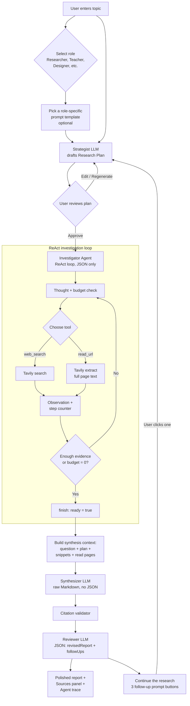

# Deep Researcher Agent

An autonomous AI research assistant for the UF College of Education. Pick a
role, enter a topic (or start from a role-specific template), and the app
will plan, search the web, read sources, and synthesize a fully cited
Markdown report — all from the browser.

> **Experimental.** AI responses may be inaccurate; always double-check
> citations and claims.

---

## Features

- **Role-based prompt library** — 11 user roles (Researcher, School Teacher,
  Higher-Ed Instructor, Instructional Designer, Education Leader, Experience
  Designer, Software Developer, Communications & Marketing, Video & Media
  Producer, Business & Operations, Human Resources). Each role exposes 6
  curated starter prompts tuned to its day-to-day work.
- **Role chips below the chatbox** — every role is a one-click chip with a
  Lucide icon. Researcher is selected by default; switching chips swaps in
  that role's template grid only.
- **Guided workflow** — Topic → Plan → Searching → Report stepper so you
  always know where the agent is.
- **Plan-first** — A strategist LLM drafts an actionable research plan
  (objective, key questions, suggested queries, target sources, pitfalls,
  report structure). You can approve, edit, or regenerate it before any
  searches run.
- **Multi-agent architecture** — A ReAct **investigator** gathers evidence,
  a dedicated **synthesizer** writes the final report, then the synthesizer
  returns for a **review pass** to polish the draft and propose follow-up
  research prompts. Splitting these roles avoids JSON-escaping crashes on
  large Markdown and produces higher-quality, fully-cited prose.
- **Live trace** — Collapsible view of every thought, search (with site
  favicons), and page read.
- **Cited Markdown report** — Inline links back to every source, validated
  against the gathered URL set.
- **Continue the research** — After the review pass, the app surfaces 3
  suggested follow-up prompts that fill the most important gaps in the
  report. One click starts a new research run pre-filled with that prompt.
- **Bring-your-own keys** — Optional client-side override of the NaviGator
  (LLM) and Tavily (web search) API keys.

---

## How the multi-agent process works

The app uses specialized LLM roles instead of one monolithic prompt:

1. **Strategist** drafts the research plan from the user's topic (and any
   role-specific template prompt they started from).
2. **Investigator** (ReAct loop) iteratively calls `web_search` and
   `read_url` until it has enough evidence. Its `finish` tool just signals
   readiness — it does **not** write the report.
3. **Synthesizer** receives the original question, the approved plan, the
   collected search snippets, and the full-text read pages, and writes the
   final cited Markdown report in a single raw-text (non-JSON) call. A
   citation validator then checks every link against the gathered sources.
4. **Reviewer** (the synthesizer returning in JSON mode) polishes the draft
   in place and proposes 3 follow-up research prompts targeting the gaps
   it identified. Each follow-up is a one-click launch into a new run.




### Why split the agent?

| Concern | Single ReAct loop | Split investigator + synthesizer |
| --- | --- | --- |
| JSON safety | A single unescaped quote in a 1,500-word Markdown report crashes `JSON.parse()`. | Zero risk — synthesis returns raw Markdown. |
| Report quality | Model splits attention between JSON schema and prose. | Model focuses entirely on synthesis and citations. |
| Context | Cluttered with prior thoughts and tool errors. | Clean: question + plan + sources only. |
| Latency / cost | Slightly faster, fewer tokens. | One extra call, but dramatically better output. |

---

## Role-based prompt library

Templates live in `src/lib/research-templates.ts` as `RESEARCH_ROLE_GROUPS`,
a flat list of role groups. Each group has an `id`, `label`, `description`,
a Lucide `icon`, and a `templates` array. A flattened
`RESEARCH_TEMPLATES` export is derived via `flatMap` for any consumer that
needs the full list.

Current roles (each with 6 templates):

| Role | Icon | Example templates |
| --- | --- | --- |
| Researcher | `Microscope` | Evidence map, Research replication scan, Literature gap analysis |
| School Teacher | `GraduationCap` | Classroom strategy scan, Standards alignment, Family communication research |
| Higher-Ed Instructor | `BookOpen` | Course redesign scan, Assessment innovations, Student engagement research |
| Instructional Designer | `PencilRuler` | Instructional design brief, Modality comparison, Accessibility audit research |
| Education Leader | `Compass` | Leadership brief, Strategic initiative scan, Policy landscape review |
| Experience Designer | `Palette` | UX pattern scan, Service blueprint research, Accessibility & inclusion scan |
| Software Developer | `Code2` | Tech stack comparison, Security & privacy architecture scan, Integration feasibility |
| Communications & Marketing | `Megaphone` | Messaging landscape, Channel & audience scan, Campaign benchmark research |
| Video & Media Producer | `Video` | Production workflow scan, Format & distribution research, Accessibility for media |
| Business & Operations | `Briefcase` | Process improvement scan, Vendor & tooling comparison, Risk & compliance research |
| Human Resources | `Users` | Change management research brief, Hiring market and role design scan, L&D program research |

The UI (`src/components/research/PromptInput.tsx`) renders one chip per
role below the main chatbox. Clicking a chip swaps in only that role's
template grid; clicking a template fills the textarea with the prompt so
the user can edit the bracketed placeholders before submitting.

---

## Components

- **PromptInput** — topic entry, role chips, role-scoped template grid,
  model + max-sources settings.
- **PlanReview** — renders the plan and accepts free-form edits or full
  regeneration before research starts.
- **WorkflowStepper** — horizontal Topic / Plan / Searching / Report
  indicator.
- **AgentTrace** — collapsible thought / search / read / finish trace with
  per-result favicon thumbnails.
- **ReportView + SourcesPanel** — final cited Markdown + deduplicated
  source list.

## Server functions

All API keys stay server-side. Three TanStack Start server functions
(`createServerFn`) wrap the providers:

- `navigator-chat.functions.ts` — proxies the UF NaviGator chat completions
  endpoint. Called three times per research run: planner, investigator
  turns (JSON mode), and synthesizer (raw Markdown).
- `web-search.functions.ts` — proxies Tavily web search.
- `read-url.functions.ts` — proxies Tavily page extraction.

## Prompts

- `plan-prompts.ts` — strategist system prompt + revision prompt.
- `agent-prompts.ts` — investigator ReAct prompt, observation builders,
  budget warnings, **and** the synthesizer prompt + context-block builder
  (`SYNTHESIS_SYSTEM_PROMPT`, `buildSynthesisUserMessage`).
- `research-templates.ts` — role-grouped starter prompts shown in the UI.

---

## Tech stack

- **TanStack Start** (React 19, Vite 7, SSR-ready, Cloudflare Workers
  target)
- **Tailwind CSS v4** with semantic design tokens in `src/styles.css`
- **shadcn/ui** primitives + **Lucide** icons
- **Zod** input validation on every server function
- **react-markdown** + **remark-gfm** for report rendering

---

## Local development

```bash
bun install
bun run dev
```

Set these environment variables (or paste keys at runtime via the API keys
panel in the UI):

```bash
UF_NAVIGATOR_API_KEY=...
TAVILY_API_KEY=...
```

---

## Project structure

```text
src/
├── routes/
│   ├── __root.tsx          # SSR shell, sitewide meta
│   └── index.tsx           # State machine: input → plan → research → done
├── components/research/    # PromptInput, PlanReview, WorkflowStepper,
│                           # AgentTrace, ProgressTracker, ReportView,
│                           # SourcesPanel, Disclaimer, PasswordGate
├── lib/
│   ├── navigator-chat.functions.ts   # LLM server fn
│   ├── web-search.functions.ts       # Tavily search server fn
│   ├── read-url.functions.ts         # Tavily extract server fn
│   ├── agent-prompts.ts              # ReAct + synthesis prompts
│   ├── plan-prompts.ts               # Plan + revision prompts
│   ├── research-templates.ts         # Role-grouped prompt templates
│   ├── citation-validator.ts         # Verifies report links vs sources
│   ├── models.ts                     # NaviGator model list
│   └── user-settings.ts              # localStorage settings
└── styles.css              # Design tokens (oklch)
```
